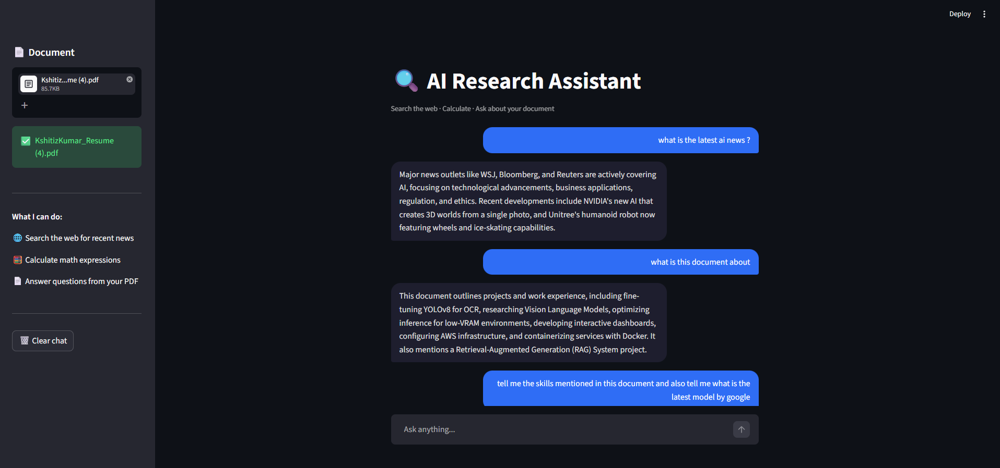
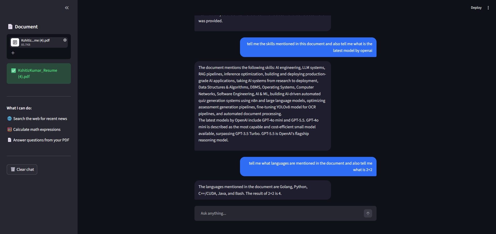

# AI Research Assistant

An intelligent research agent built with LangGraph that autonomously decides which tool to use based on your question — no manual routing required.

**GitHub:** [NotKshitiz/ai-research-assistant](https://github.com/NotKshitiz/ai-research-assistant)

---

## What it does

Ask anything in natural language. The agent figures out the right approach:

| Your question | What the agent does |
|---|---|
| "What is the latest news about AI?" | Searches the web using Tavily |
| "What is 15% of 50000?" | Runs the calculator tool |
| "What does my PDF say about neural networks?" | Searches your uploaded document using RAG |
| "Summarize my document and find related news online" | Uses both web search and RAG simultaneously |

That last case — using multiple tools in one response — is what makes this an agent and not just a chatbot.

---

## How it works

```
User question
      ↓
Agent (Gemini 2.5 Flash) reasons about what tools are needed
      ↓
Calls relevant tools — web search, calculator, or document RAG
      ↓
Reads tool results
      ↓
Generates a grounded, combined answer
```

The agent can chain multiple tools in a single response. Ask it to "summarize the document and search for related trends" and it will call both the RAG tool and web search, then synthesize the results into one coherent answer.

---

## Tech stack

| Component | Tool |
|---|---|
| Agent framework | LangGraph |
| LLM | Gemini 2.5 Flash via Google AI Studio |
| Web search | Tavily API |
| Document RAG | LangChain + ChromaDB + HuggingFace MiniLM |
| UI | Streamlit |
| Language | Python |

---
## Demo




## Project structure

```
ai-research-assistant/
├── app.py       # Streamlit chat UI
├── agent.py     # LangGraph agent with tool definitions
├── tools.py     # Web search, calculator, document RAG functions
└── .env         # API keys (not committed)
```

Separation of concerns — UI, agent logic, and tools are in separate files.

---

## Run locally

**1. Clone**
```bash
git clone https://github.com/NotKshitiz/ai-research-assistant.git
cd ai-research-assistant
```

**2. Install**
```bash
pip install -r requirements.txt
```

**3. Set up API keys**

Create a `.env` file:
```
GEMINI_API_KEY=your_gemini_key
TAVILY_API_KEY=your_tavily_key
```

Get free keys at:
- Gemini: aistudio.google.com
- Tavily: tavily.com

**4. Run**
```bash
streamlit run app.py
```

---

## Key design decisions

**Why LangGraph over a simple LLM chain?**
LangGraph gives the agent a state machine — it can reason, call a tool, observe the result, and decide whether to call another tool or answer. A simple chain can't do this.

**Why three separate tools instead of one?**
Each tool has a specific purpose and description. The LLM reads these descriptions to decide which tool fits the question. Combining them into one tool would remove the agent's ability to reason about routing.

**Why Gemini 2.5 Flash?**
Strong tool calling support, large context window, and generous free tier. Ideal for an agent that needs to reason about multiple tool results simultaneously.

---

## Author

**Kshitiz Kumar** — AI Engineer  
[LinkedIn](https://linkedin.com/in/yourprofile) | [GitHub](https://github.com/NotKshitiz)